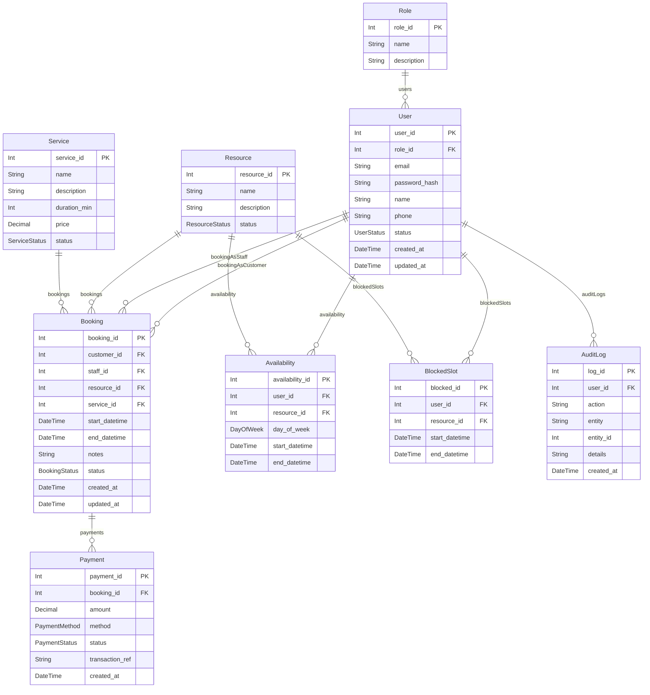
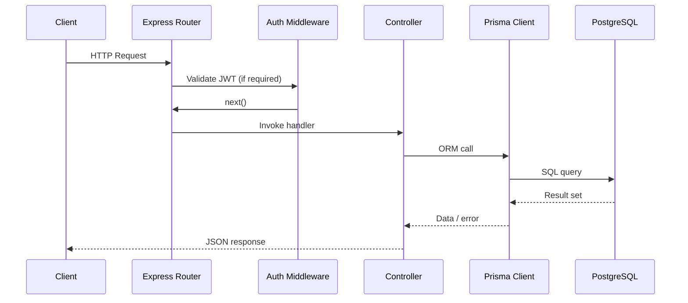

# Booking API

A Node.js + Express service managing users, roles, services, resources, bookings, payments, availability, and blocked slots with Prisma ORM and JWT-based auth.

## Tech Stack
- Node.js, Express, Prisma ORM
- PostgreSQL (development & test)
- JWT authentication, bcrypt password hashing
- Jest + Supertest automated tests
- Swagger UI for OpenAPI docs

## Quick Start
1. **Install dependencies**  
   ```bash
   npm install
   ```
2. **Generate Prisma client & OpenAPI schemas**  
   ```bash
   npm run generate
   ```
3. **Run migrations (dev DB)**  
   ```bash
   npx prisma migrate deploy
   ```
4. **Seed + run tests (uses `.env.test`)**  
   ```bash
   npm test
   ```
5. **Start API**  
   ```bash
   npm run dev
   ```
   Visit docs at [http://localhost:3000/api-docs](http://localhost:3000/api-docs).

## Database ERD


## Request Flow


## Testing & Quality
- `npm test` – full suite (`tests/setup.js` resets & seeds DB)
- `npm run test:unit`, `npm run test:integration`, `npm run test:coverage`
- Coverage collected for controllers, routers, middleware

## Documentation
- Swagger UI: `GET /api-docs`
- OpenAPI JSON: `GET /openapi.json`
- Run `npm run generate` after Prisma schema changes to refresh generated docs.